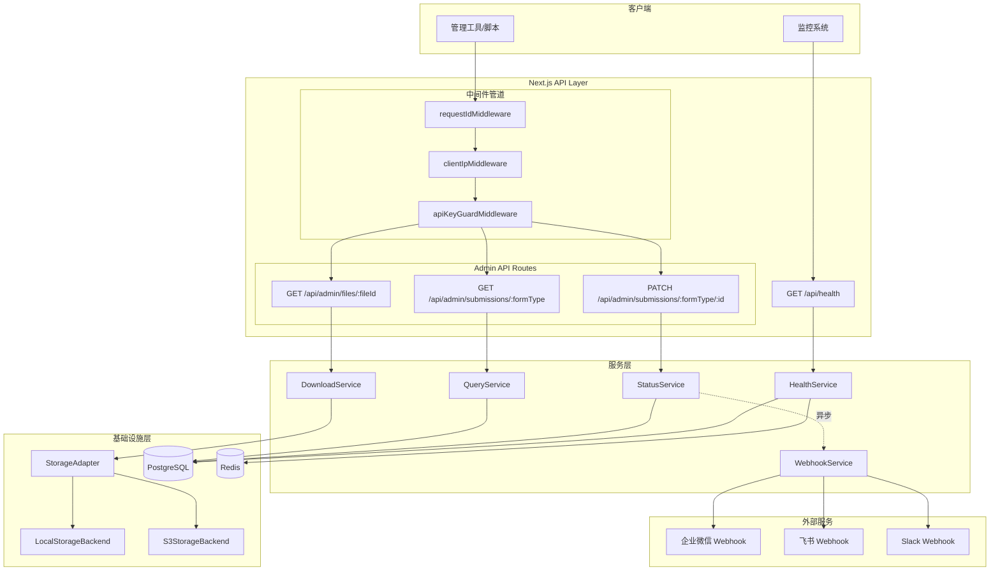
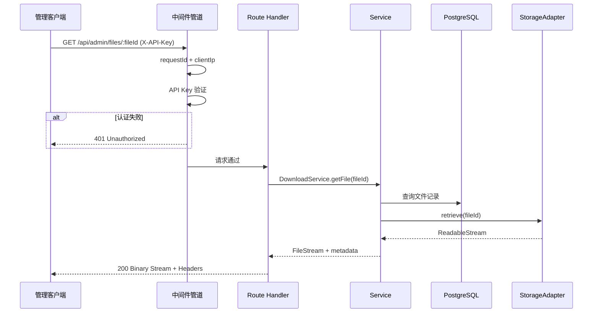
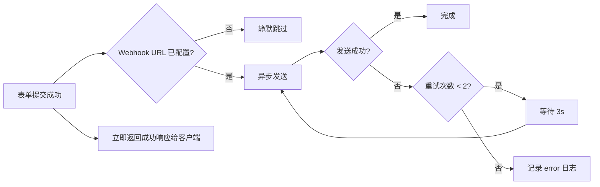

# 技术设计文档：后端运营管理功能

## Overview

本设计文档描述 Inspira Energy 新加坡新能源基金投资平台的后端运营管理功能技术实现方案。该功能覆盖七个核心模块：文件下载 API、提交查询 API、提交状态更新 API、健康检查端点、即时通知集成、文件存储抽象层和 API Key 认证。

### 设计目标

- 在现有 Next.js 16 App Router + Drizzle ORM + ioredis 架构上增量扩展
- 复用现有中间件组合器模式（`composeMiddleware`）和统一响应格式
- 文件存储抽象层采用策略模式，支持本地文件系统与 S3 兼容对象存储热切换
- Webhook 通知采用异步发送+重试机制，不阻塞表单提交响应
- 所有管理 API 端点受 API Key 认证保护

### 技术栈

| 层级 | 技术选型 | 备注 |
|------|----------|------|
| 框架 | Next.js 16 (App Router) | Route Handlers |
| ORM | Drizzle ORM + pg | 连接池管理 |
| 缓存 | ioredis | 优雅降级 |
| 验证 | Zod v4 | Schema 验证 |
| 日志 | Pino | 结构化 JSON |
| 测试 | Vitest + fast-check | 单元测试 + 属性测试 |
| 对象存储 | @aws-sdk/client-s3 | S3 兼容后端 |

## Architecture

### 系统架构图



### 请求处理流程



### 目录结构设计

```
src/
├── app/api/
│   ├── admin/
│   │   ├── files/
│   │   │   └── [fileId]/
│   │   │       └── route.ts          # 文件下载 API
│   │   └── submissions/
│   │       └── [formType]/
│   │           ├── route.ts           # 提交查询 API
│   │           └── [submissionId]/
│   │               └── route.ts       # 状态更新 API
│   └── health/
│       └── route.ts                   # 健康检查端点
├── lib/
│   ├── admin/
│   │   ├── auth-guard.ts              # API Key 认证中间件
│   │   ├── download-service.ts        # 文件下载服务
│   │   ├── query-service.ts           # 提交查询服务
│   │   └── status-service.ts          # 状态更新服务
│   ├── health/
│   │   └── index.ts                   # 健康检查服务
│   ├── storage/
│   │   ├── adapter.ts                 # 存储适配器接口 + 工厂
│   │   ├── local-backend.ts           # 本地文件系统后端
│   │   └── s3-backend.ts             # S3 兼容后端
│   └── webhook/
│       ├── index.ts                   # Webhook 服务入口
│       └── formatters.ts             # 平台消息格式化器
└── types/
    └── api.ts                         # 新增错误码和类型（扩展现有）
```

## Components and Interfaces

### 1. API Key 认证中间件 (`apiKeyGuardMiddleware`)

```typescript
// src/lib/admin/auth-guard.ts

import { MiddlewareHandler, RequestContext } from "@/lib/middleware";
import { NextRequest, NextResponse } from "next/server";

/**
 * API Key 认证中间件
 * - 从 X-API-Key 请求头获取 key
 * - 使用 constant-time comparison 验证（防止 timing attack）
 * - 认证失败记录 warn 日志（IP + path + timestamp）
 */
export function apiKeyGuardMiddleware(): MiddlewareHandler;

/**
 * 创建管理 API 中间件管道
 * 执行顺序: requestId → clientIp → apiKeyGuard
 */
export function createAdminMiddlewarePipeline(): MiddlewareHandler;
```

**设计决策**：
- 使用 `crypto.timingSafeEqual` 进行常量时间字符串比较，防止 timing attack
- `ADMIN_API_KEY` 未配置时返回 503（服务未就绪），而非 500
- 认证中间件作为独立函数，可组合到不同管道中

### 2. 文件存储抽象层 (`StorageAdapter`)

```typescript
// src/lib/storage/adapter.ts

/** 存储后端类型 */
export type StorageBackendType = "local" | "s3";

/** 存储错误分类 */
export type StorageErrorCode =
  | "connection_error"
  | "not_found"
  | "permission_denied"
  | "storage_full";

/** 存储操作错误 */
export class StorageError extends Error {
  readonly errorCode: StorageErrorCode;
}

/** 存储后端统一接口 */
export interface IStorageBackend {
  /** 保存文件，返回存储标识符 */
  store(filename: string, data: Buffer, mimeType: string): Promise<string>;
  /** 获取文件流 */
  retrieve(identifier: string): Promise<{ stream: ReadableStream; mimeType: string; size: number }>;
  /** 检查文件是否存在 */
  exists(identifier: string): Promise<boolean>;
  /** 删除文件 */
  delete(identifier: string): Promise<void>;
  /** 验证存储后端连通性（启动时调用） */
  healthCheck(): Promise<boolean>;
}

/** 存储适配器工厂 —— 根据 STORAGE_BACKEND 环境变量创建对应后端 */
export function createStorageAdapter(): IStorageBackend;

/** 获取全局存储适配器单例 */
export function getStorageAdapter(): IStorageBackend;
```

**设计决策**：
- 采用策略模式（Strategy Pattern），接口层对调用方透明
- 文件标识符（identifier）与后端无关 —— 本地用 UUID 文件名，S3 用 object key（均为 UUID 格式）
- 错误码枚举化，不暴露后端实现细节
- 启动时验证后端可用性并记录日志
- 默认回退到 "local" 并发出 warn 日志

### 3. 文件下载服务 (`DownloadService`)

```typescript
// src/lib/admin/download-service.ts

export interface FileDownloadResult {
  stream: ReadableStream;
  filename: string;       // URL-encoded 原始文件名
  mimeType: string;
  size: number;
}

export const DownloadService = {
  /**
   * 通过 fileId 获取文件下载流
   * 1. 查询 developer_submissions.filePaths 确认文件记录存在
   * 2. 从 StorageAdapter 获取文件流
   * 3. 返回流 + 元数据
   */
  getFile(fileId: string): Promise<FileDownloadResult>;
};
```

**设计决策**：
- fileId 即为 StoredFile.storedName（UUID + 扩展名格式）
- 先验证 fileId 在数据库 filePaths JSONB 中存在（防止枚举攻击）
- 使用 Web Streams API 流式传输，不将整个文件加载到内存

### 4. 提交查询服务 (`QueryService`)

```typescript
// src/lib/admin/query-service.ts

/** 允许的表单类型 */
export type AdminFormType = "lp-interest" | "developer" | "contact" | "newsletter";

/** 查询参数 */
export interface QueryParams {
  formType: AdminFormType;
  status?: "pending" | "contacted" | "closed";
  startDate?: string;  // ISO 8601
  endDate?: string;    // ISO 8601
  email?: string;      // case-insensitive substring
  search?: string;     // cross-field search
  page: number;        // default 1, min 1
  pageSize: number;    // default 20, min 1, max 100
}

/** 分页响应 */
export interface PaginatedResult<T> {
  data: T[];
  pagination: {
    total: number;
    page: number;
    pageSize: number;
    totalPages: number;
  };
}

export const QueryService = {
  /** 查询指定表单类型的提交记录 */
  query(params: QueryParams): Promise<PaginatedResult<unknown>>;
};
```

**设计决策**：
- formType 映射到对应的 Drizzle 表：`lp-interest` → `lpInterestSubmissions`，`developer` → `developerSubmissions`，`contact` → `contactSubmissions`，`newsletter` → `newsletterSubscriptions`
- 分页使用 OFFSET/LIMIT（数据量可控，不需要游标分页）
- `totalPages` = `Math.ceil(total / pageSize)`
- search 参数在 name、company/institution、email 字段上做 ILIKE 匹配
- 所有查询结果按 `created_at DESC` 排序

### 5. 提交状态更新服务 (`StatusService`)

```typescript
// src/lib/admin/status-service.ts

export interface StatusUpdateResult {
  id: string;
  status: "pending" | "contacted" | "closed";
  updatedAt: string;  // ISO 8601
}

export const StatusService = {
  /**
   * 更新指定提交的状态
   * 1. 验证 status 值合法性
   * 2. 查询提交记录是否存在
   * 3. 更新 status + updated_at
   * 4. 返回更新后的记录
   */
  updateStatus(
    formType: AdminFormType,
    submissionId: string,
    status: "pending" | "contacted" | "closed"
  ): Promise<StatusUpdateResult>;
};
```

**设计决策**：
- 需要在数据库 schema 中为所有提交表添加 `updated_at` 字段（迁移）
- 使用 Drizzle 的 `returning()` 获取更新后的记录
- 状态转换无限制（可从任意状态转到任意状态）

### 6. 健康检查服务 (`HealthService`)

```typescript
// src/lib/health/index.ts

export interface ComponentHealth {
  status: "healthy" | "unhealthy";
  error?: string;
  latencyMs: number;
}

export interface HealthCheckResult {
  status: "healthy" | "degraded";
  version: string;
  responseTimeMs: number;
  components: {
    database: ComponentHealth;
    cache: ComponentHealth;
  };
}

export const HealthService = {
  /** 执行所有组件健康检查 */
  check(): Promise<HealthCheckResult>;
};
```

**设计决策**：
- PostgreSQL 检查：`SELECT 1`，3 秒超时
- Redis 检查：`PING`，2 秒超时
- 两项检查并行执行以减少总响应时间
- version 从 package.json 的 `version` 字段读取
- 无需认证，便于外部监控工具轮询

### 7. Webhook 通知服务 (`WebhookService`)

```typescript
// src/lib/webhook/index.ts

/** 支持的 Webhook 平台 */
export type WebhookPlatform = "wechat" | "feishu" | "slack";

/** 通知内容 */
export interface NotificationPayload {
  formType: string;
  name: string;
  email: string;
  timestamp: string;
  summary: Record<string, string>;
}

export const WebhookService = {
  /**
   * 异步发送 Webhook 通知
   * - 不阻塞调用方
   * - 失败重试 2 次，间隔 3 秒
   * - 所有尝试失败后记录 error 日志但不影响业务流程
   */
  sendNotificationAsync(payload: NotificationPayload): void;
};
```

**设计决策**：
- 使用 `Promise` + `void` 返回实现异步发射不等待（fire-and-forget）
- 消息格式化器按平台独立实现：WeChat Work（markdown card）、Feishu（interactive card）、Slack（Block Kit）
- `WEBHOOK_URL` 未配置时静默跳过
- 使用原生 `fetch` API 发送 HTTP 请求
- 超时 10 秒，重试 2 次，固定 3 秒间隔

## Data Models

### Schema 变更

需要为提交表添加 `updated_at` 字段以支持状态更新时间追踪：

```sql
-- 迁移脚本
ALTER TABLE lp_interest_submissions ADD COLUMN updated_at TIMESTAMP WITH TIME ZONE;
ALTER TABLE developer_submissions ADD COLUMN updated_at TIMESTAMP WITH TIME ZONE;
ALTER TABLE contact_submissions ADD COLUMN updated_at TIMESTAMP WITH TIME ZONE;
```

Drizzle Schema 扩展：

```typescript
// 在各提交表中添加
updatedAt: timestamp("updated_at", { withTimezone: true }),
```

### 查询参数验证 Schema

```typescript
// Zod 验证 schema
const queryParamsSchema = z.object({
  status: z.enum(["pending", "contacted", "closed"]).optional(),
  startDate: z.string().datetime().optional(),
  endDate: z.string().datetime().optional(),
  email: z.string().max(254).optional(),
  search: z.string().max(200).optional(),
  page: z.coerce.number().int().min(1).default(1),
  pageSize: z.coerce.number().int().min(1).max(100).default(20),
});

const statusUpdateSchema = z.object({
  status: z.enum(["pending", "contacted", "closed"]),
});
```

### 环境变量扩展

```dotenv
# ─── Admin API ─────────────────────────────────────────────────────────────
ADMIN_API_KEY=your-secure-api-key-here

# ─── Storage Backend ───────────────────────────────────────────────────────
STORAGE_BACKEND=local
# S3 配置（当 STORAGE_BACKEND=s3 时必填）
S3_ENDPOINT=https://s3.amazonaws.com
S3_BUCKET=inspira-energy-uploads
S3_ACCESS_KEY=your-access-key
S3_SECRET_KEY=your-secret-key
S3_REGION=ap-southeast-1

# ─── Webhook ───────────────────────────────────────────────────────────────
WEBHOOK_URL=https://qyapi.weixin.qq.com/cgi-bin/webhook/send?key=xxx
WEBHOOK_PLATFORM=wechat
```

### API 响应格式

#### 文件下载响应

```
HTTP/1.1 200 OK
Content-Type: application/pdf
Content-Disposition: attachment; filename*=UTF-8''%E9%A1%B9%E7%9B%AE%E5%8F%AF%E7%A0%94%E6%8A%A5%E5%91%8A.pdf
Content-Length: 1048576
X-Request-Id: 550e8400-e29b-41d4-a716-446655440000

[binary data]
```

#### 查询响应

```json
{
  "success": true,
  "data": {
    "data": [...],
    "pagination": {
      "total": 42,
      "page": 1,
      "pageSize": 20,
      "totalPages": 3
    }
  }
}
```

#### 状态更新响应

```json
{
  "success": true,
  "data": {
    "id": "550e8400-e29b-41d4-a716-446655440000",
    "status": "contacted",
    "updatedAt": "2024-01-15T10:30:00.000Z"
  }
}
```

#### 健康检查响应

```json
{
  "status": "healthy",
  "version": "0.1.0",
  "responseTimeMs": 45,
  "components": {
    "database": { "status": "healthy", "latencyMs": 12 },
    "cache": { "status": "healthy", "latencyMs": 3 }
  }
}
```


## Correctness Properties

*属性（Property）是一种在系统所有有效执行中都应成立的特征或行为——本质上是关于系统应该做什么的形式化声明。属性是人类可读规范与机器可验证正确性保证之间的桥梁。*

### Property 1: 文件下载响应头格式正确性

*For any* 文件元数据（包含任意合法原始文件名和 MIME 类型），DownloadService 生成的响应头 SHALL 满足：Content-Type 等于存储的 MIME 类型，Content-Disposition 使用 `attachment` 格式并对非 ASCII 文件名按 RFC 5987 进行 URL 编码。

**Validates: Requirements 1.1, 1.4**

### Property 2: 错误响应不泄漏内部细节

*For any* 存储 I/O 错误（包含任意内部文件路径、存储后端标识或堆栈信息），返回给客户端的错误响应消息 SHALL 不包含任何内部路径、文件系统类型或后端实现细节。

**Validates: Requirements 1.5**

### Property 3: 无效 formType 验证

*For any* 字符串 `s` 不属于 `["lp-interest", "developer", "contact", "newsletter"]`，查询验证函数 SHALL 拒绝该输入并返回 400 错误码。反之，属于允许列表的字符串 SHALL 通过验证。

**Validates: Requirements 2.2**

### Property 4: 状态筛选正确性

*For any* 提交记录集合和任意有效状态值 `status`，对该集合应用状态筛选后返回的所有记录的 status 字段 SHALL 等于筛选值。

**Validates: Requirements 2.3**

### Property 5: 日期范围筛选正确性

*For any* 提交记录集合和任意有效日期范围 `[startDate, endDate]`，筛选后返回的所有记录的 created_at 时间戳 SHALL 满足 `startDate <= created_at <= endDate`。

**Validates: Requirements 2.4**

### Property 6: 邮箱筛选大小写不敏感子串匹配

*For any* 提交记录集合和任意搜索字符串 `q`，邮箱筛选后返回的所有记录 SHALL 满足 `record.email.toLowerCase()` 包含 `q.toLowerCase()` 作为子串。

**Validates: Requirements 2.5**

### Property 7: 跨字段搜索正确性

*For any* 提交记录集合和任意搜索字符串 `search`，搜索结果中的每条记录 SHALL 满足至少一个目标字段（name、company/institution、email）以大小写不敏感方式包含 `search` 作为子串。

**Validates: Requirements 2.10**

### Property 8: 分页切片与元数据正确性

*For any* 总记录数 `total >= 0`、页码 `page >= 1`、每页条数 `1 <= pageSize <= 100`，分页逻辑 SHALL 满足：(1) `totalPages = Math.ceil(total / pageSize)`（total 为 0 时 totalPages 为 0）；(2) 当 `page <= totalPages` 时返回正确的 offset 切片；(3) 当 `page > totalPages` 时返回空数据数组；(4) 返回的记录按 created_at 降序排列。

**Validates: Requirements 2.6, 2.7, 2.8**

### Property 9: 状态更新持久化正确性

*For any* 有效提交记录和任意有效状态值，执行状态更新后返回的记录 SHALL 反映新的状态值，且 updated_at 字段被设置为有效的 UTC 时间戳（与操作时间差在合理范围内）。

**Validates: Requirements 3.1, 3.5**

### Property 10: 无效状态值验证

*For any* 字符串 `s` 不属于 `["pending", "contacted", "closed"]`，状态更新验证 SHALL 拒绝该输入并返回 400 错误码，且错误消息中包含允许的状态值列表。

**Validates: Requirements 3.2**

### Property 11: 健康状态聚合逻辑

*For any* 组件健康状态组合（database: healthy|unhealthy, cache: healthy|unhealthy），整体健康状态 SHALL 满足：当且仅当所有组件均为 "healthy" 时整体状态为 "healthy"（HTTP 200），否则为 "degraded"（HTTP 503）。

**Validates: Requirements 4.4, 4.5**

### Property 12: Webhook 消息格式化完整性

*For any* 通知载荷（NotificationPayload）和任意目标平台，格式化后的消息 SHALL 同时满足：(1) 包含所有必需字段（formType、name、email、timestamp、summary）；(2) 符合目标平台的消息结构规范（WeChat Work markdown card / Feishu interactive card / Slack Block Kit）。

**Validates: Requirements 5.3, 5.4**

### Property 13: 存储后端回退行为

*For any* `STORAGE_BACKEND` 环境变量值不等于 "local" 且不等于 "s3"（包括空字符串和 undefined），StorageAdapter 工厂 SHALL 回退到 "local" 后端实现。

**Validates: Requirements 6.5**

### Property 14: 存储操作 Round-Trip

*For any* 有效文件内容（任意字节序列）和有效文件名，通过 StorageAdapter 执行 store 操作获得标识符后，使用该标识符执行 retrieve 操作 SHALL 返回与原始内容字节相同的数据流。且 exists(identifier) 返回 true。

**Validates: Requirements 6.6**

### Property 15: 存储错误封装

*For any* 存储操作失败场景，抛出的 StorageError SHALL 携带枚举化的 errorCode（connection_error | not_found | permission_denied | storage_full），且错误消息不包含后端特定路径或 SDK 内部信息。

**Validates: Requirements 6.7**

### Property 16: 常量时间比较函数正确性

*For any* 两个字符串 `a` 和 `b`，常量时间比较函数 SHALL 返回 `true` 当且仅当 `a === b`。

**Validates: Requirements 7.1**

### Property 17: 认证失败信息不泄漏

*For any* 无效 API Key（空字符串、部分匹配、格式错误、完全不同的值），返回的 401 错误响应 SHALL 具有相同的错误码和相同的错误消息文本，不透露 key 的格式或值是否部分正确。

**Validates: Requirements 7.3**

### Property 18: 认证失败日志完整性

*For any* 认证失败事件（来自任意客户端 IP 和任意请求路径），产生的 warn 级别日志 SHALL 包含三个字段：clientIp、requestPath 和 timestamp。

**Validates: Requirements 7.4**

## Error Handling

### 错误分类与响应策略

| 错误类型 | HTTP 状态码 | 错误码 | 处理策略 |
|----------|-------------|--------|----------|
| API Key 缺失 | 401 | UNAUTHORIZED | 中间件短路返回 |
| API Key 无效 | 401 | UNAUTHORIZED | 中间件短路返回 + warn 日志 |
| API Key 未配置 | 503 | SERVICE_NOT_CONFIGURED | 中间件短路返回 |
| 无效 formType | 400 | VALIDATION_ERROR | 列出允许值 |
| 无效状态值 | 400 | VALIDATION_ERROR | 列出允许值 |
| 查询参数格式错误 | 400 | VALIDATION_ERROR | 字段级错误 |
| 文件不存在 | 404 | NOT_FOUND | 通用 "文件未找到" 消息 |
| 提交记录不存在 | 404 | NOT_FOUND | 通用 "记录未找到" 消息 |
| 存储 I/O 错误 | 500 | INTERNAL_ERROR | 固定通用消息，不暴露路径 |
| 数据库操作失败 | 500 | INTERNAL_ERROR | 固定通用消息 |
| 数据库连接超时 | 503 | SERVICE_UNAVAILABLE | 触发重试逻辑 |

### 错误码扩展

在现有 `ERROR_CODES` 常量中新增：

```typescript
export const ERROR_CODES = {
  // ... 现有错误码
  UNAUTHORIZED: "UNAUTHORIZED",
  NOT_FOUND: "NOT_FOUND",
  SERVICE_NOT_CONFIGURED: "SERVICE_NOT_CONFIGURED",
} as const;
```

### 错误传播原则

1. **服务层**：抛出具体类型化错误（`AuthenticationError`、`NotFoundError`、`StorageError`）
2. **Route Handler 层**：捕获服务层错误，映射为统一响应格式
3. **中间件层**：认证失败直接短路返回，不进入 Route Handler
4. **绝不暴露**：文件路径、数据库表名、SQL 语句、堆栈追踪、第三方服务标识

### Webhook 错误隔离



## Testing Strategy

### 测试框架

- **单元测试**：Vitest（已配置）
- **属性测试**：fast-check v4（已安装）
- **集成测试**：Vitest + 数据库 fixtures

### 属性测试配置

```typescript
import fc from "fast-check";

// 所有属性测试统一配置：最少 100 次迭代
const PBT_CONFIG = { numRuns: 100 };
```

每个属性测试必须包含标签注释：

```typescript
// Feature: backend-operations, Property 1: 文件下载响应头格式正确性
it.prop(...);
```

### 单元测试覆盖

| 模块 | 测试重点 | 类型 |
|------|----------|------|
| auth-guard | API Key 验证逻辑 | 属性测试 + 示例测试 |
| download-service | 文件元数据查询、响应头生成 | 属性测试 |
| query-service | 筛选逻辑、分页计算 | 属性测试 |
| status-service | 状态验证、更新逻辑 | 属性测试 + 示例测试 |
| health-service | 状态聚合逻辑 | 属性测试 |
| webhook/formatters | 消息格式化 | 属性测试 |
| storage/adapter | 后端路由、Round-trip | 属性测试 |

### 集成测试覆盖

| 场景 | 测试重点 |
|------|----------|
| 完整认证流程 | 有效/无效/缺失 API Key 的端到端行为 |
| 文件下载流 | 从数据库查询到文件流返回的完整路径 |
| 查询+分页 | 多条件组合查询的数据库交互 |
| 状态更新 | 数据库写入+返回的事务完整性 |
| 健康检查 | 真实 PostgreSQL + Redis 连通性验证 |
| Webhook 重试 | 模拟失败场景的重试行为 |

### 测试目录结构

```
test/
├── unit/
│   ├── admin/
│   │   ├── auth-guard.test.ts
│   │   ├── download-service.test.ts
│   │   ├── query-service.test.ts
│   │   └── status-service.test.ts
│   ├── health/
│   │   └── health-service.test.ts
│   ├── storage/
│   │   ├── adapter.test.ts
│   │   ├── local-backend.test.ts
│   │   └── s3-backend.test.ts
│   └── webhook/
│       └── formatters.test.ts
└── integration/
    ├── admin-api.test.ts
    ├── health-api.test.ts
    └── webhook-retry.test.ts
```

### 属性测试与单元测试的职责划分

- **属性测试**：验证普遍性质（任意输入下行为不变量）——筛选正确性、分页数学、格式化完整性、Round-trip、错误封装
- **单元测试**：验证具体示例和边界场景——404 返回、空配置行为、特定平台消息格式、CORS 行为
- 两者互补：属性测试覆盖广度，单元测试覆盖深度和具体场景
